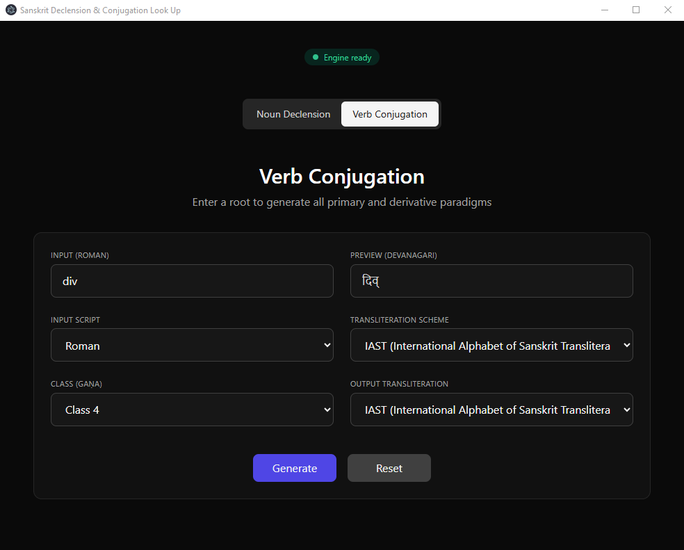
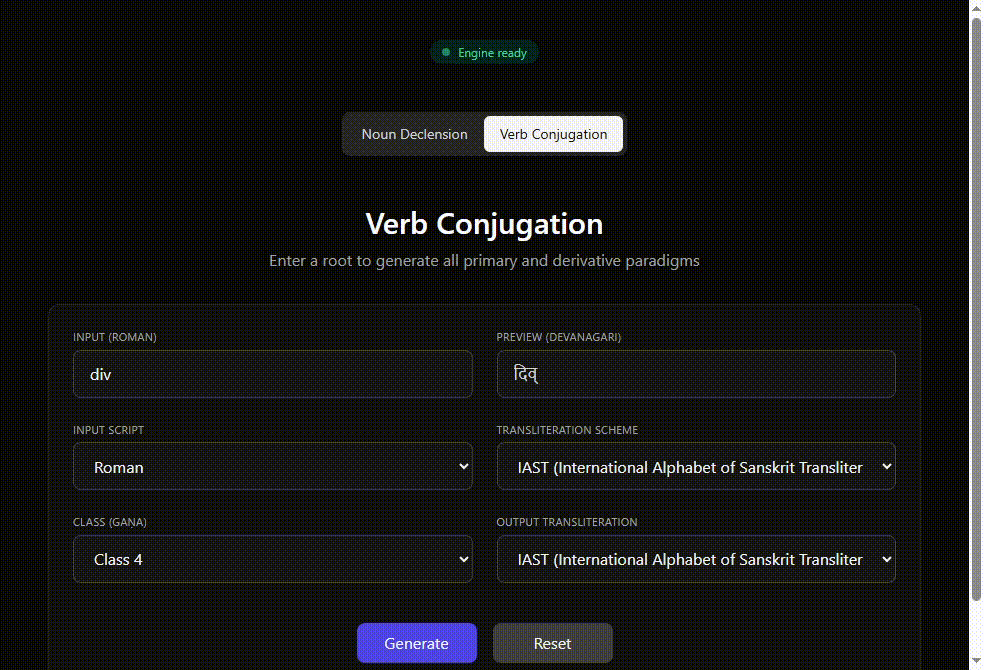

# Sanskrit Lookup App

> A research-oriented desktop application for Sanskrit word lookup, declension generation, and verb conjugation generation using finite-state morphology.



## Demo



## Download

Latest release:

**[Download Latest Release](../../releases/latest)**

---

## About the Project

This project began as a student research experiment investigating whether Sanskrit morphology could be generated entirely on-the-fly rather than relying on large precomputed databases.

The central research question was:

> **Can a Sanskrit grammar engine generate declensions and conjugations in real time directly from grammatical rules?**

The answer is largely yes.

Noun declensions can be generated accurately and efficiently, while verb conjugations are also possible but considerably slower due to the complexity of Sanskrit verbal morphology and the large number of interacting grammatical processes.

Although a lower-level implementation (e.g., C++ or Rust) or a dedicated linguistic formalism similar to those used in production-grade systems such as INRIA would likely offer substantially better performance, this project demonstrates that large portions of Sanskrit morphology can be generated dynamically using finite-state methods.

The application serves both as a practical lookup tool and as an exploration of computational linguistics, finite-state morphology, and rule-based language modeling.

---

## Architecture

```text
Electron + React Desktop Client
               |
               v
          Flask API
               |
               v
      Pynini FST Engine
               |
               v
 Sanskrit Morphology Generation
```

### Desktop Client

**Tech Stack:** Electron, React, JavaScript

The desktop interface allows users to search Sanskrit lexical entries and generate declension and conjugation tables dynamically.

### Linguistic Engine

**Tech Stack:** Python, Flask API, Pynini, Finite State Transducers (FSTs)

The React/Electron frontend communicates with a local Flask server responsible for all linguistic processing.

When a user requests a declension or conjugation:

1. The frontend sends grammatical specifications to the API.
2. The API invokes the finite-state grammar engine.
3. The engine generates morphological forms.
4. Results are returned as JSON and rendered by the desktop client.

This separation allows the linguistic engine and user interface to evolve independently while keeping computationally intensive processing isolated from the frontend.

---

## Evaluation
The project was evaluated using morphological data from INRIA's Sanskrit linguistic resources. We are sincerely grateful to Gérard Huet and the INRIA Sanskrit project for making these resources publicly available.

The system was evaluated against morphological datasets from the INRIA Sanskrit Project. All forms were generated dynamically by the FST engine without relying on INRIA lookup tables. 

### Declension Generation

More than 45 representative nouns and adjectives spanning multiple stem classes, genders, cases, and numbers were tested against INRIA declension data.

| Result | Value |
|----------|----------|
| Exact Match | 1,108,609 (96.5%) |
| Incorrect | 40,309 |
| Crash | 0 |
| Runtime | 244.67s |

The benchmark covered approximately 1.15 million generated forms.

Most remaining errors occur in phonological alternations and irregular stem classes, particularly:

- Nasal-final stems
- Retroflex-final stems
- Final consonant sandhi
- Stem alternations before declensional suffixes

The absence of execution failures demonstrates the stability of the finite-state architecture when applied to large-scale morphological generation.

### Verb Conjugation Generation

Verb conjugation was benchmarked against INRIA verbal paradigms.

Each test case consisted of a unique combination of:

- Root
- Gaṇa (verb class)
- Lakāra (tense/mood)
- Voice
- Person
- Number
- Derivational category

A total of 168,265 paradigm cells were evaluated.

| Result | Value |
|----------|----------|
| Exact Match | 135,445 (~80.4%) |
| Partial Match | 7,883 |
| Total Coverage | ~85.2% |
| Fail | 24,937 |
| Crash | 0 |

Partial matches primarily occur in:

- Future
- Periphrastic Future
- Aorist

where the engine intentionally generates multiple valid morphological variants while INRIA often records a single preferred form.

### Error Analysis

The remaining failures are concentrated in a relatively small number of recurring grammatical patterns rather than being randomly distributed.

Major sources include:

- Class 10 denominative verbs in Future and Periphrastic Future formations
- Class 1 Perfect formations involving reduplication and vowel grading
- Aorist formation across Classes 2–4
- Causative derivations with lexicalized exceptions
- Voice-specific irregularities and highly exceptional roots

These results suggest that further improvements will primarily require additional lexical information and class-specific grammatical rules rather than modifications to the core sandhi system.

Overall, the engine achieves approximately 85% strict agreement with INRIA while generating forms dynamically through finite-state rules rather than table lookup.

---

## Data Sources

The project incorporates and cross-references information from a variety of publicly available Sanskrit resources, including:

* Digital dictionaries and lexical databases
* Traditional grammatical references
* Public morphological datasets
* Open linguistic resources
* Manually curated corrections and additions

---

## Distribution

The released desktop application bundles the complete Conda environment required by the linguistic engine.

This decision was made because Pynini depends on native libraries and can be difficult to install through a standard Python environment, particularly on Windows systems.

Bundling the environment allows users to run the application without manually compiling or configuring the underlying finite-state toolkit.

---

## Research Areas

This project explores topics including:

* Computational Linguistics
* Sanskrit Morphology
* Finite-State Morphology
* Morphological Generation
* Natural Language Processing
* Rule-Based Language Modeling
* Finite-State Transducers (FSTs)

---

## Technologies Used

### Frontend

* Electron
* React
* JavaScript

### Backend

* Python
* Flask

### Linguistic Infrastructure

* Pynini
* OpenFst
* Finite-State Transducers

### Data Processing

* JSON-based morphological datasets
* Benchmark comparison tooling
* Automated evaluation pipelines

---

## Open Source and Academic Use

This project is open source and intended primarily for educational, research, and experimental purposes.

Contributions, issue reports, and academic discussion are welcome.

---

## Disclaimer

Sanskrit grammar is exceptionally complex and often preserves multiple competing grammatical traditions.

Generated forms may occasionally differ from forms accepted by specific grammars, dictionaries, linguistic schools, or teaching materials.

**This application should be viewed as a research and educational tool rather than an authoritative linguistic reference.**
